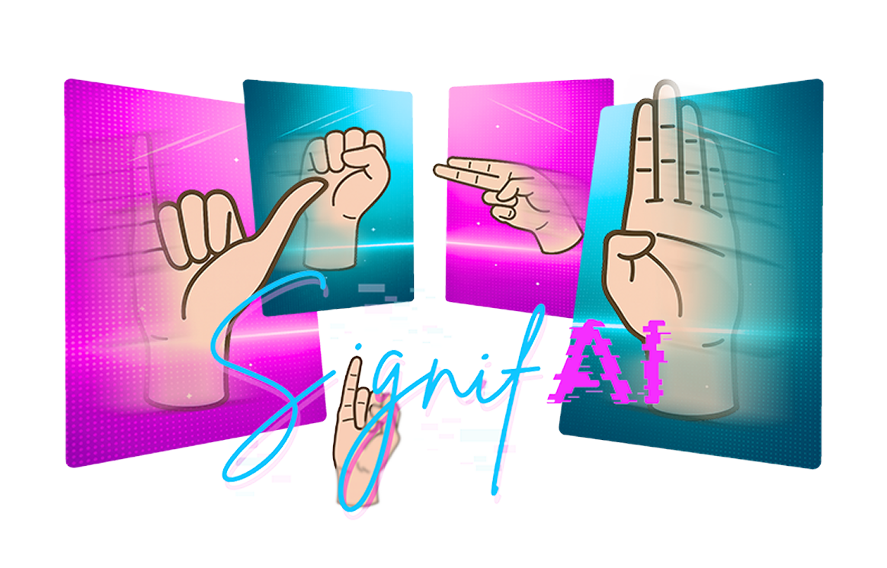
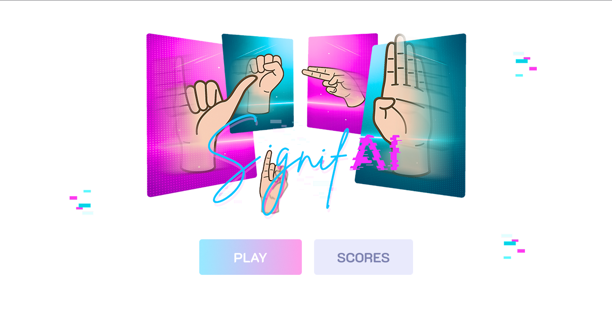
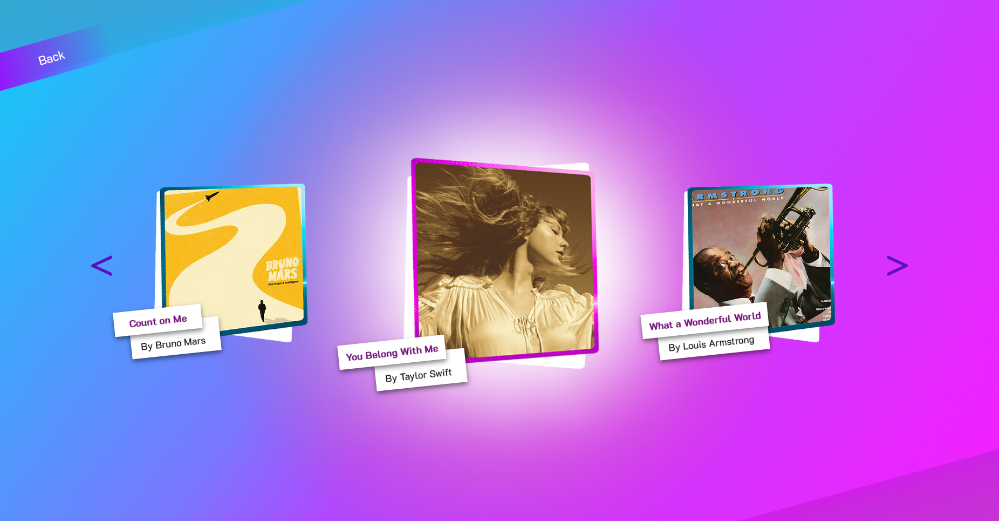
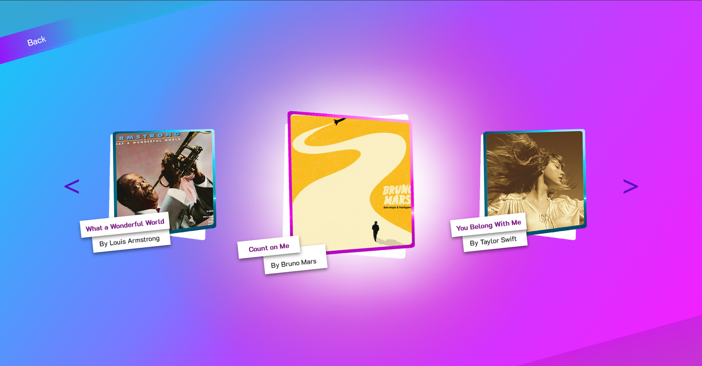
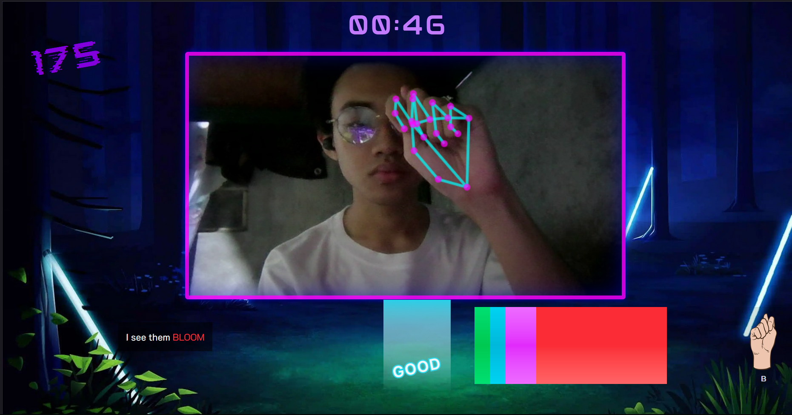
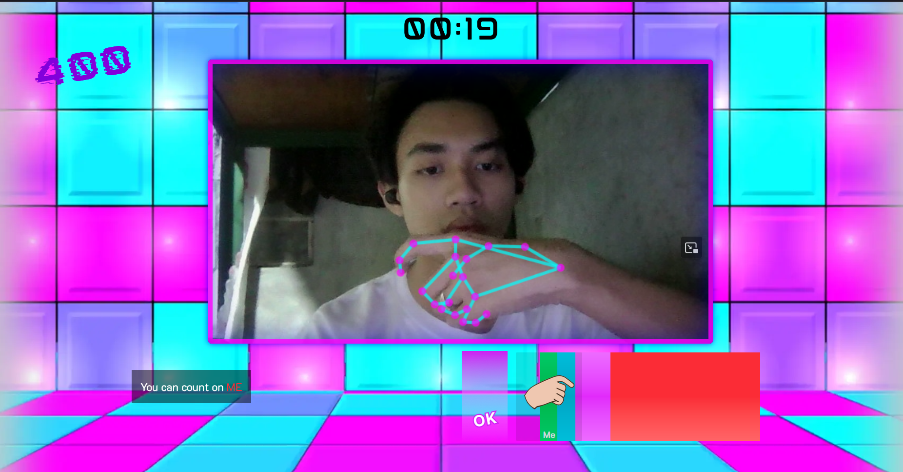
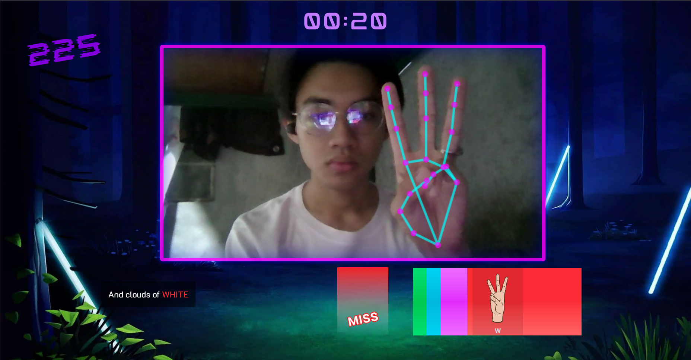
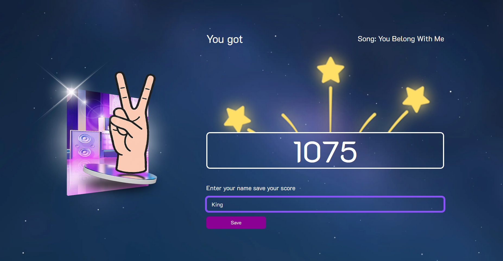
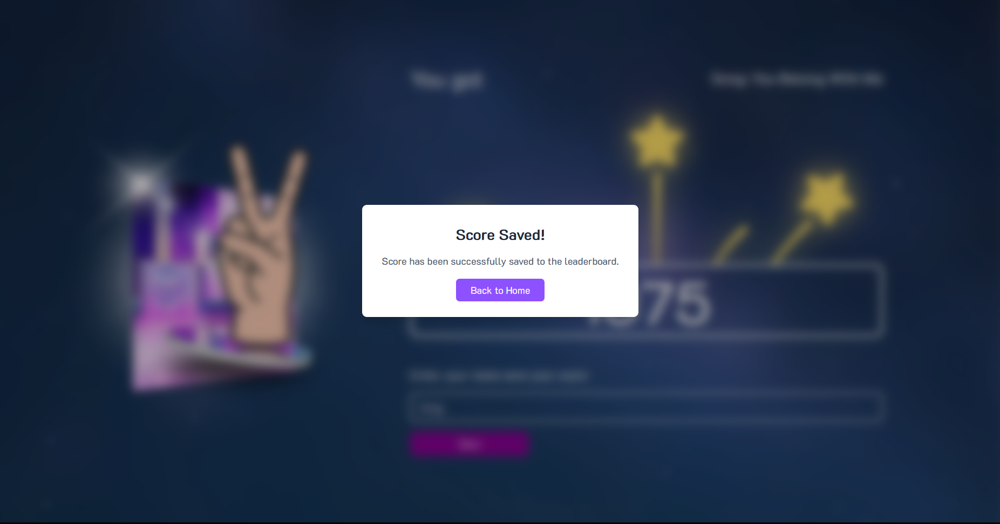
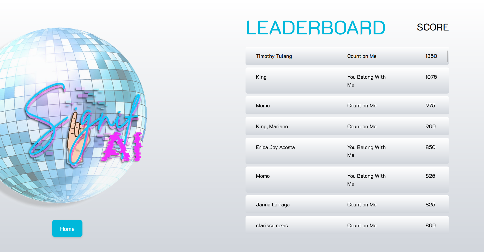

# SignifAI 🎵🤟



***SignifAI*** is an interactive rhythm-based sign language game that combines music, hand gesture recognition, and fun gameplay. Players perform ***American Sign Language*** (ASL) gestures in sync with music to score points and improve their ASL skills.

---

## 🚀 Features

- **Rhythm-Based Gameplay**: Perform ASL gestures in time with the music.
- **Hand Gesture Recognition**: Uses TensorFlow.js and MediaPipe to detect hand gestures in real-time.
- **Dynamic Song Selection**: Choose from a variety of songs with different difficulty levels.
- **Scoring System**: Earn points based on accuracy and timing (e.g., "PERFECT", "GOOD", "OK", "MISS").
- **Leaderboard**: Save your score and compete with others.
- **Custom Animations**: Smooth animations for hand movements, ratings, and UI transitions.
- **Camera Integration**: Real-time webcam feed for gesture detection.
- **Firebase Integration**: Save and fetch leaderboard data from Firestore.

---

## 🛠️ Tech Stack

- **Frontend**: React, TypeScript, TailwindCSS
- **Machine Learning**: TensorFlow.js, MediaPipe
- **State Management**: Redux Toolkit
- **Routing**: React Router
- **Backend**: Firebase Firestore
- **Build Tool**: Vite

---

## 📸 Screenshots

### Home Page


### Song Selection



### Gameplay





### Results



### Leaderboard


---

## 📂 Project Structure

```bash
├── public/                     # Public assets accessible directly in the browser
│   ├── signifai_favicon.svg    # Favicon for the app
│   ├── splash_screen.png       # Splash screen image
│   └── models/                 # Machine learning models for gesture recognition
│       ├── model.json          # TensorFlow.js model configuration
│       └── group1-shard1of1.bin # Model weights for TensorFlow.js
├── src/                        # Source code for the application
│   ├── app/                    # Core application setup
│   │   ├── hooks.ts            # Custom hooks for global state and utilities
│   │   ├── routes.tsx          # Application routes and navigation
│   │   └── store.ts            # Redux store configuration
│   ├── assets/                 # Static assets like audio, fonts, and images
│   │   ├── audio/              # Audio files for the game
│   │   ├── fonts/              # Custom fonts used in the app
│   │   └── img/                # Images used in the app
│   ├── components/             # Reusable UI components
│   │   └── SplashScreenAnimation.tsx # Splash screen animation component
│   ├── config/                 # Configuration files
│   │   └── songs_config.json   # Configuration for songs (title, duration, gestures, etc.)
│   ├── constants/              # Constants used throughout the app
│   │   ├── audio.ts            # Audio file paths and metadata
│   │   └── images.ts           # Image file paths and metadata
│   ├── features/               # Feature-specific code
│   │   ├── game/               # Game-related logic and components
│   │   │   ├── pages/          # Pages for the game (e.g., gameplay, results)
│   │   │   ├── hooks/          # Custom hooks for game logic
│   │   │   ├── utils/          # Utility functions for the game
│   │   │   ├── gameReducer.ts  # Reducer for managing game state
│   │   │   └── gameTypes.ts    # Type definitions for game-related data
│   │   └── leaderboard/        # Leaderboard-related logic and components
│   ├── globals/                # Global utilities and state
│   │   ├── camera/             # Camera setup and utilities
│   │   └── appState/           # Global application state management
│   ├── hooks/                  # Custom hooks shared across the app
│   ├── styles/                 # Global styles
│   │   └── styles.css          # Main CSS file for styling
│   └── utils/                  # Utility functions and helpers
│       ├── firebase.ts         # Firebase integration for Firestore and authentication
│       ├── handLandmarkerHelper.ts # Helper functions for hand gesture recognition
│       ├── modelHelper.ts      # Helper functions for TensorFlow.js model loading
│       └── timeHelpers.ts      # Utility functions for time formatting and calculations
├── .env                        # Environment variables (e.g., Firebase configuration)
├── .gitignore                  # Files and directories to ignore in Git
├── index.html                  # Main HTML file for the app
├── package.json                # Project dependencies and scripts
├── README.md                   # Project documentation
├── tsconfig.json               # TypeScript configuration
├── tsconfig.app.json           # TypeScript configuration for the app
├── tsconfig.node.json          # TypeScript configuration for Node.js
└── vite.config.ts              # Vite configuration for building the app
```

---

## 🎮 How to Play

1. **Select a Song**: Choose a song from the song selection screen.
2. **Perform Gestures**: Follow the prompts and perform the correct ASL gestures in time with the music.
3. **Score Points**: Earn points based on your accuracy and timing.
4. **Save Your Score**: Enter your name and save your score to the leaderboard.

---

## 🛠️ Setup and Installation

### Prerequisites
- Node.js (v16 or higher)
- npm or yarn

### Installation Steps
1. Clone the repository:
   ```bash
   git clone https://github.com/your-username/signifai.git
   cd signifai
   ```

2. Install Dependencies
    ```bash
    npm install
    ```

3. Set up Firebase:
  - Create a Firebase project.
  - Add your Firebase configuration to a .env file:

    ```bash
    VITE_FIREBASE_API_KEY=your_api_key
    VITE_FIREBASE_AUTH_DOMAIN=your_auth_domain
    VITE_FIREBASE_PROJECT_ID=your_project_id
    VITE_FIREBASE_STORAGE_BUCKET=your_storage_bucket
    VITE_FIREBASE_MESSAGING_SENDER_ID=your_messaging_sender_id
    VITE_FIREBASE_APP_ID=your_app_id
    VITE_FIREBASE_MEASUREMENT_ID=your_measurement_id
    ```

4. Start the development server:
    ```bash
    npm run dev
    ```

5. Open the app in your browser:
    ```bash
    http://localhost:5173
    ```

🧪 Testing
  - Run ESLint
  
    ```bash
    npm run lint
    ```

---

### 📖 Configuration
Songs Configuration
  Add or modify songs in `src/config/songs_config.json` Each song includes:

  - `title`: The song's title.
  - `author`: The artist's name.
  - `tempo`: The song's tempo.
  - `song_duration`: Duration in milliseconds.
  - `entries`: Array of hand gesture entries with `timestamp`, `duration`, `lyric`, `prompt`, and `asl`.

---

🛡️ License
This project is licensed under the MIT License. See the LICENSE file for details.

--- 

📧 Contact
For questions or feedback, please contact [kmarianu@gmail.com].